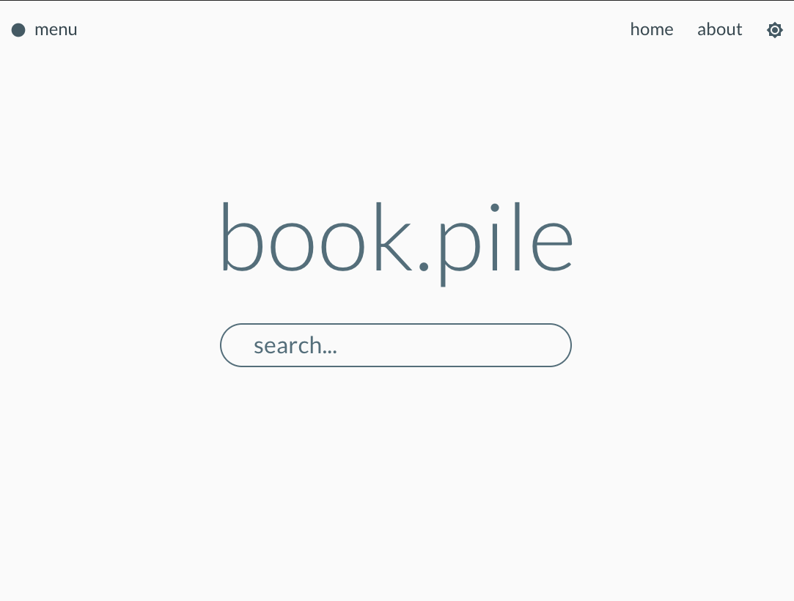

# Books App

## Description
book.pile is a simple book search app where you can quickly find books by title, author or subject. Details about each book can be found by clicking on each result.

## App Screenshot

## Technologies Used
- HTML, CSS, Javascript
- React.js
- Create React App
- React Router DOM
- Material-UI
- Axios
- Surge.sh
## Installation Instructions
#### Web:
Simply go to https://book-pile.surg.sh

#### Local:
Clone this repo then run npm install or yarn, then npm start or yarn start 
## Wireframes

## Component Hierarchy

## MVP
- Provide users with a quick and simple book searching source
## Post-MVP / Stretch Goals
- Add user login capabilities with user options(bookmarking/favorites, suggested and trends)
- Add a social media aspect that allows friends to make suggestions or post their recommendations
- Add a user store to post books for sale

## Contribution Guidelines
In order to contribute or support, you can:
- Fork and clone this repo and submit pull requests  
or
- Submit a new issue